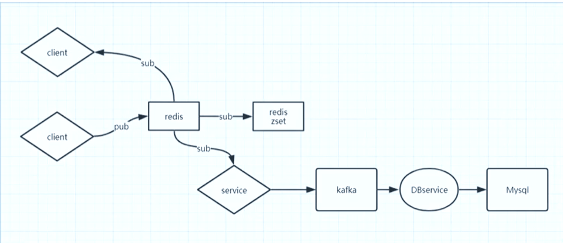

### 场景1：统计每个用户的登录天数
假设jack这名用户，分别在第6天，第23天，第134天，和第364天登录了系统。
可以执行如下命令：
```bash
setbit jack 6 1
setbit jack 23 1
setbit jack 134 1
setbit jack 364 1
```
统计jack登录的天数，直接可以通过：
```bash
bitcount jack
```
### 场景2：电商网站派发礼物
假设某个电商网站做活动，在某天要派送礼物，假设这个网站有2亿用户，请问应该备货多少礼物比较适合
思路：
首先，可以考虑一下统计整个网站的活跃用户有多少，比如我们设置三天，1号，2号，3号，统计三天登录的用户获得一个近似的活跃用户的数量:
```bash
# 编号为2的用户登在2019年1月1号录了一次
setbit 20190101   2  1
# 编号为3的用户在2019年1月2号登录了一次
setbit 20190102   3  1
# 编号为7的用户在2019年1月2号登录了一次
setbit 20190102   7  1
# 编号为7的用户在2019年1月3号登录了一次
setbit 20190103   7  1
```
然后通过：
```bash
# 将每一天标识的人数（位置上为1）的数进行与运算
bitop  or   destkey 20190101  20190102  20190103
```
然后求这个destkey中含有的1的数量，即为比较活跃的用户（派发礼物需要准备的礼物数量）
```bash
BITCOUNT  destkey
```
### 抢购，秒杀，详情页，点赞，评论
都可以使用Redis的incr方法，这样就可以规避并发下，对数据库的事务操作，完全由redis内存操作代替
### 通过管道连接Redis发送命令
```bash
apt install nc
[root@node01 ~]# nc localhost 6379
keys *
*0
set k1 heelo
+OK

[root@node1 utils]# echo -e "set k2 99\nincr k2\n get k2" | nc localhost 6379
+OK
:100
$3
100
```
### 关于大量初始化数据
参考[大量初始化数据](http://www.redis.cn/topics/mass-insert.html)
### 发布/订阅功能
```bash
127.0.0.1:6379> subscribe xxx
Reading messages... (press Ctrl-C to quit)
1) "subscribe"
2) "xxx"
3) (integer) 1
1) "message"
2) "xxx"
3) "hellod"

127.0.0.1:6379> publish xxx hellod
(integer) 1
```
如果需要考虑获取实时数据和历史数据
关于实时数据

pub/sub功能
关于历史消息
三天前（sorted_set）
更早以前（来自数据库）
架构如下：

### 为什么 Redis 的事务不支持回滚（roll back）
摘自：http://www.redis.cn/topics/transactions.html

以下是这种做法的优点：

Redis 命令只会因为错误的语法而失败（并且这些问题不能在入队时发现），或是命令用在了错误类型的键上面：

这也就是说，从实用性的角度来说，失败的命令是由编程错误造成的，而这些错误应该在开发的过程中被发现，而不应该出现在生产环境中。

因为不需要对回滚进行支持，所以 Redis 的内部可以保持简单且快速。

有种观点认为 Redis 处理事务的做法会产生 bug ， 然而需要注意的是， 在通常情况下， 回滚并不能解决编程错误带来的问题。

举个例子， 如果你本来想通过 INCR 命令将键的值加上 1 ， 却不小心加上了 2 ， 又或者对错误类型的键执行了 INCR ， 回滚是没有办法处理这些情况的。

### 参考
[1] [Grey的博客](https://www.cnblogs.com/greyzeng/p/8547299.html)
